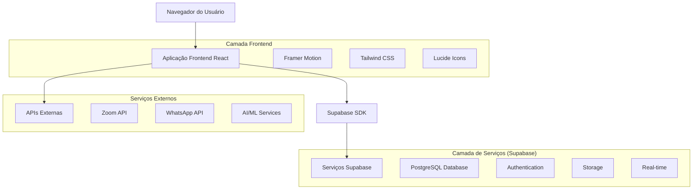

# Documento de Arquitetura Técnica - Legacy Mentoring Platform

## 1. Design da Arquitetura



## 2. Descrição da Tecnologia

- **Frontend**: React@19 + TypeScript@5 + Vite@5 + Tailwind CSS@3 + Framer Motion@11
- **Backend**: Supabase (PostgreSQL + Auth + Storage + Real-time)
- **Ícones**: Lucide React
- **Animações**: Framer Motion + CSS nativo
- **Build**: Vite com code splitting
- **Deploy**: Vercel/Netlify com CDN global

## 3. Definições de Rotas

| Rota | Propósito |
|------|----------|
| / | Redirecionamento para /login ou /dashboard |
| /login | Página de autenticação Vision Pro |
| /register | Registro de novos usuários |
| /dashboard | Dashboard principal com widgets e acesso rápido |
| /academy | Lista de cursos e módulos educacionais |
| /academy/:courseId | Página específica do curso com vídeos |
| /academy/:courseId/:lessonId | Player de vídeo da aula |
| /mentorship | Hub de mentorias com gravações e sessões |
| /mentorship/:sessionId | Player de sessão específica |
| /cases | Lista e submissão de casos clínicos |
| /cases/:caseId | Detalhes e discussão do caso |
| /cases/submit | Formulário de submissão de novo caso |
| /microlessons | Biblioteca de microaulas categorizadas |
| /microlessons/:categoryId | Vídeos por categoria |
| /protocols | Downloads de checklists e protocolos |
| /protocols/:protocolId | Visualização de protocolo específico |
| /library | Biblioteca de artigos científicos |
| /library/:articleId | Visualizador de artigo com PDF |
| /calendar | Calendário de eventos e mentorias |
| /marketing | Módulos de marketing e crescimento |
| /archive | Acervo WhatsApp com busca |
| /profile | Perfil e configurações do usuário |
| /settings | Configurações da aplicação |
| /help | Central de ajuda e suporte |

## 4. Design System Vision Pro

### 4.1 Cores e Superfícies

```css
/* Backgrounds Ultra-Escuros */
--bg-primary: #0a0a0f;
--bg-secondary: #1a1a2e;
--bg-tertiary: #2d2d44;

/* 8 Níveis de Superfícies de Vidro */
--glass-1: rgba(255, 255, 255, 0.02);
--glass-2: rgba(255, 255, 255, 0.04);
--glass-3: rgba(255, 255, 255, 0.06);
--glass-4: rgba(255, 255, 255, 0.08);
--glass-5: rgba(255, 255, 255, 0.10);
--glass-6: rgba(255, 255, 255, 0.12);
--glass-7: rgba(255, 255, 255, 0.15);
--glass-8: rgba(255, 255, 255, 0.18);

/* Texto */
--text-primary: rgba(255, 255, 255, 0.95);
--text-secondary: rgba(255, 255, 255, 0.70);
--text-tertiary: rgba(255, 255, 255, 0.50);
```

### 4.2 Efeitos Glassmorphism

```css
/* Ultra-Blur Base */
.glass-base {
  backdrop-filter: blur(60px);
  -webkit-backdrop-filter: blur(60px);
  border: 1px solid rgba(255, 255, 255, 0.1);
  border-radius: 32px;
}

/* Ultra-Blur Intenso */
.glass-intense {
  backdrop-filter: blur(120px);
  -webkit-backdrop-filter: blur(120px);
  border: 1px solid rgba(255, 255, 255, 0.15);
  border-radius: 32px;
}

/* Hover Effects */
.glass-hover:hover {
  transform: scale(1.02);
  filter: brightness(1.1);
  transition: all 300ms ease;
}
```

## 5. Modelo de Dados

### 5.1 Tabelas Principais

```sql
-- Usuários
CREATE TABLE users (
    id UUID PRIMARY KEY DEFAULT gen_random_uuid(),
    email VARCHAR(255) UNIQUE NOT NULL,
    name VARCHAR(100) NOT NULL,
    specialty VARCHAR(100),
    crm VARCHAR(20),
    role VARCHAR(20) DEFAULT 'student',
    avatar_url TEXT,
    preferences JSONB DEFAULT '{}',
    created_at TIMESTAMP WITH TIME ZONE DEFAULT NOW(),
    updated_at TIMESTAMP WITH TIME ZONE DEFAULT NOW()
);

-- Cursos
CREATE TABLE courses (
    id UUID PRIMARY KEY DEFAULT gen_random_uuid(),
    title VARCHAR(200) NOT NULL,
    description TEXT,
    instructor VARCHAR(100) NOT NULL,
    duration INTEGER DEFAULT 0,
    thumbnail_url TEXT,
    category VARCHAR(50),
    is_active BOOLEAN DEFAULT true,
    created_at TIMESTAMP WITH TIME ZONE DEFAULT NOW()
);

-- Módulos
CREATE TABLE modules (
    id UUID PRIMARY KEY DEFAULT gen_random_uuid(),
    course_id UUID REFERENCES courses(id) ON DELETE CASCADE,
    title VARCHAR(200) NOT NULL,
    description TEXT,
    video_url TEXT NOT NULL,
    duration INTEGER DEFAULT 0,
    order_index INTEGER NOT NULL,
    materials JSONB DEFAULT '[]',
    created_at TIMESTAMP WITH TIME ZONE DEFAULT NOW()
);

-- Progresso do Usuário
CREATE TABLE user_progress (
    id UUID PRIMARY KEY DEFAULT gen_random_uuid(),
    user_id UUID REFERENCES users(id) ON DELETE CASCADE,
    module_id UUID REFERENCES modules(id) ON DELETE CASCADE,
    completed BOOLEAN DEFAULT false,
    watch_time INTEGER DEFAULT 0,
    completed_at TIMESTAMP WITH TIME ZONE,
    created_at TIMESTAMP WITH TIME ZONE DEFAULT NOW(),
    UNIQUE(user_id, module_id)
);

-- Casos Clínicos
CREATE TABLE clinical_cases (
    id UUID PRIMARY KEY DEFAULT gen_random_uuid(),
    user_id UUID REFERENCES users(id) ON DELETE CASCADE,
    title VARCHAR(200) NOT NULL,
    description TEXT NOT NULL,
    patient_age INTEGER,
    procedure_type VARCHAR(100),
    images TEXT[] DEFAULT '{}',
    videos TEXT[] DEFAULT '{}',
    status VARCHAR(20) DEFAULT 'pending',
    mentor_feedback TEXT,
    created_at TIMESTAMP WITH TIME ZONE DEFAULT NOW(),
    updated_at TIMESTAMP WITH TIME ZONE DEFAULT NOW()
);

-- Sessões de Mentoria
CREATE TABLE mentorship_sessions (
    id UUID PRIMARY KEY DEFAULT gen_random_uuid(),
    title VARCHAR(200) NOT NULL,
    description TEXT,
    scheduled_at TIMESTAMP WITH TIME ZONE NOT NULL,
    duration INTEGER DEFAULT 60,
    recording_url TEXT,
    transcript TEXT,
    status VARCHAR(20) DEFAULT 'scheduled',
    created_at TIMESTAMP WITH TIME ZONE DEFAULT NOW()
);

-- Microaulas
CREATE TABLE microlessons (
    id UUID PRIMARY KEY DEFAULT gen_random_uuid(),
    title VARCHAR(200) NOT NULL,
    category VARCHAR(50) NOT NULL,
    video_url TEXT NOT NULL,
    duration INTEGER DEFAULT 0,
    tags TEXT[] DEFAULT '{}',
    surgical_moment VARCHAR(50),
    created_at TIMESTAMP WITH TIME ZONE DEFAULT NOW()
);

-- Protocolos
CREATE TABLE protocols (
    id UUID PRIMARY KEY DEFAULT gen_random_uuid(),
    title VARCHAR(200) NOT NULL,
    type VARCHAR(20) NOT NULL,
    file_url TEXT NOT NULL,
    file_size INTEGER,
    checkboxes JSONB DEFAULT '[]',
    created_at TIMESTAMP WITH TIME ZONE DEFAULT NOW()
);
```

## 6. Componentes Base

### 6.1 Estrutura de Componentes

```
src/components/
├── ui/
│   ├── GlassCard.tsx
│   ├── GlassButton.tsx
│   ├── GlassInput.tsx
│   ├── GlassModal.tsx
│   └── Navigation.tsx
├── layout/
│   ├── Sidebar.tsx
│   ├── Header.tsx
│   └── Layout.tsx
├── features/
│   ├── auth/
│   ├── dashboard/
│   ├── academy/
│   ├── mentorship/
│   ├── cases/
│   └── microlessons/
└── common/
    ├── VideoPlayer.tsx
    ├── FileUpload.tsx
    └── SearchBar.tsx
```

## 7. Configuração Tailwind

```javascript
// tailwind.config.js
module.exports = {
  content: ['./src/**/*.{js,ts,jsx,tsx}'],
  theme: {
    extend: {
      colors: {
        'bg-primary': '#0a0a0f',
        'bg-secondary': '#1a1a2e',
        'bg-tertiary': '#2d2d44',
      },
      backdropBlur: {
        'ultra': '60px',
        'intense': '120px',
      },
      borderRadius: {
        'ultra': '32px',
      },
      fontFamily: {
        'sf': ['-apple-system', 'BlinkMacSystemFont', 'SF Pro Display', 'sans-serif'],
      },
    },
  },
  plugins: [],
}
```

## 8. Estrutura de Páginas

### 8.1 Páginas Principais

1. **Login/Register** - Autenticação com design Vision Pro
2. **Dashboard** - Hub central com widgets e estatísticas
3. **Academy** - Cursos estruturados (Browlift, Endomidface, Deep Neck)
4. **Mentorship** - Sessões ao vivo e gravações
5. **Cases** - Submissão e discussão de casos clínicos
6. **Microlessons** - Biblioteca de vídeos rápidos
7. **Protocols** - Downloads de checklists e protocolos
8. **Library** - Artigos científicos
9. **Calendar** - Agenda de eventos
10. **Marketing** - Estratégias de crescimento
11. **Archive** - Acervo WhatsApp
12. **Profile** - Configurações do usuário
13. **Settings** - Configurações da aplicação
14. **Help** - Central de suporte

## 9. Integração Supabase

### 9.1 Configuração

```typescript
// lib/supabase.ts
import { createClient } from '@supabase/supabase-js'

const supabaseUrl = process.env.VITE_SUPABASE_URL!
const supabaseAnonKey = process.env.VITE_SUPABASE_ANON_KEY!

export const supabase = createClient(supabaseUrl, supabaseAnonKey)
```

### 9.2 Políticas RLS

```sql
-- Habilitar RLS em todas as tabelas
ALTER TABLE users ENABLE ROW LEVEL SECURITY;
ALTER TABLE courses ENABLE ROW LEVEL SECURITY;
ALTER TABLE modules ENABLE ROW LEVEL SECURITY;
ALTER TABLE user_progress ENABLE ROW LEVEL SECURITY;
ALTER TABLE clinical_cases ENABLE ROW LEVEL SECURITY;
ALTER TABLE mentorship_sessions ENABLE ROW LEVEL SECURITY;
ALTER TABLE microlessons ENABLE ROW LEVEL SECURITY;
ALTER TABLE protocols ENABLE ROW LEVEL SECURITY;

-- Políticas básicas
CREATE POLICY "Users can view own profile" ON users FOR SELECT USING (auth.uid() = id);
CREATE POLICY "Users can update own profile" ON users FOR UPDATE USING (auth.uid() = id);
CREATE POLICY "Courses are viewable by authenticated users" ON courses FOR SELECT TO authenticated USING (is_active = true);
CREATE POLICY "Users can view own progress" ON user_progress FOR SELECT USING (auth.uid() = user_id);
CREATE POLICY "Users can update own progress" ON user_progress FOR ALL USING (auth.uid() = user_id);
```

## 10. Performance e Otimização

### 10.1 Code Splitting

```typescript
// Lazy loading de páginas
const Dashboard = lazy(() => import('./pages/Dashboard'))
const Academy = lazy(() => import('./pages/Academy'))
const Mentorship = lazy(() => import('./pages/Mentorship'))
```

### 10.2 Caching

```typescript
// React Query para cache de dados
import { useQuery } from '@tanstack/react-query'

const { data: courses } = useQuery({
  queryKey: ['courses'],
  queryFn: () => supabase.from('courses').select('*'),
  staleTime: 5 * 60 * 1000, // 5 minutos
})
```

## 11. Deploy e CI/CD

### 11.1 Vercel Configuration

```json
// vercel.json
{
  "builds": [
    {
      "src": "package.json",
      "use": "@vercel/static-build",
      "config": {
        "distDir": "dist"
      }
    }
  ],
  "routes": [
    {
      "src": "/(.*)",
      "dest": "/index.html"
    }
  ]
}
```

### 11.2 Environment Variables

```bash
# .env.example
VITE_SUPABASE_URL=your_supabase_url
VITE_SUPABASE_ANON_KEY=your_supabase_anon_key
VITE_APP_URL=http://localhost:5173
```