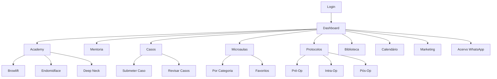

# Documento de Requisitos do Produto - Legacy Mentoring Platform

## 1. Visão Geral do Produto 

A Legacy Mentoring Platform é uma plataforma de mentoria médica de classe mundial para cirurgiões plásticos de elite que aprendem técnicas avançadas de cirurgia facial com estética Vision Pro. A plataforma atende cirurgiões plásticos de elite do Brasil e América Latina, com Dr. Robério Brandão como administrador/mentor, servindo 130+ profissionais certificados ativamente praticando.

A plataforma resolve o problema da educação médica fragmentada fornecendo uma experiência de aprendizado premium, unificada e tecnologicamente avançada que permite acesso rápido a protocolos durante cirurgias, discussões colaborativas de casos e educação continuada estruturada.

O valor de mercado alvo é estabelecer um novo padrão para educação médica com rating mínimo de 4.9⭐, 70%+ de engajamento e impacto visual "Uau, isso é do futuro".

## 2. Funcionalidades Principais

### 2.1 Papéis de Usuário

| Papel | Método de Registro | Permissões Principais |
|-------|-------------------|----------------------|
| Administrador/Mentor | Acesso direto (admin@mentoria.com) | Gerenciar todos os conteúdos, aprovar casos, conduzir mentorias |
| Cirurgião Estudante | Registro por convite/código | Acessar cursos, submeter casos, participar de discussões |
| Especialista Convidado | Convite específico | Criar conteúdo especializado, conduzir sessões |

### 2.2 Módulos de Funcionalidades

Nossos requisitos da plataforma Legacy Mentoring consistem nas seguintes páginas principais:

1. **Dashboard**: seção hero, navegação de páginas, widgets de acesso rápido, contador de próxima mentoria, casos recentes, avisos importantes
2. **Academy**: cursos estruturados completos, rastreamento de progresso, capítulos de vídeo, materiais para download
3. **Mentoria**: gravações de sessões semanais, player de sessão ao vivo, transcrições de Q&A, navegação por timestamp
4. **Discussão de Casos**: formulário de submissão com drag-drop, pipeline de análise AI, workflow de aprovação do mentor, galeria de imagens/vídeos
5. **Microaulas**: vídeos de referência rápida, player otimizado para mobile, tags de momentos cirúrgicos, sistema de favoritos
6. **Checklists & Protocolos**: PDFs para download, checklists interativos, protocolos pré/intra/pós-operatórios, templates personalizados
7. **Artigos Científicos**: biblioteca organizada, visualizador de PDF inline, gerenciador de downloads, discussão por artigo
8. **Calendário**: agenda de mentorias, calendário de workshops, eventos de cirurgia ao vivo, integração Zoom
9. **Marketing & Crescimento**: estratégias para pacientes premium, diretrizes de branding, templates de mídia social, ferramentas de automação
10. **Acervo WhatsApp**: histórico de 5 turmas, busca avançada, filtros de categoria, galeria de mídia
11. **Login/Registro**: tela de login Vision Pro, registro de usuário, recuperação de senha
12. **Perfil de Usuário**: configurações de conta, preferências, informações profissionais
13. **Configurações**: aparência, privacidade, notificações, integrações
14. **Central de Ajuda**: FAQs, tutoriais, documentação, suporte

### 2.3 Detalhes das Páginas

| Nome da Página | Nome do Módulo | Descrição da Funcionalidade |
|----------------|----------------|-----------------------------|
| Dashboard | Seção Hero | Personalização "Boa noite, Dr. Robério", estatísticas em tempo real com cartões de vidro |
| Dashboard | Widgets de Acesso Rápido | Atalhos para funcionalidades mais usadas, contador de 130 estudantes ativos |
| Dashboard | Próxima Mentoria | Countdown para próxima sessão ao vivo, botão de acesso rápido |
| Dashboard | Casos Recentes | Widget com últimos casos discutidos, status de aprovação |
| Academy | Cursos Browlift & Endomidface | Módulos estruturados com vídeos, timestamps, materiais para download |
| Academy | Curso Deep Neck | Técnicas avançadas com progressão rastreada |
| Academy | Cursos de Especialistas Convidados | Conteúdo de experts externos, certificações |
| Academy | Rastreamento de Progresso | Indicadores visuais de conclusão, certificados |
| Mentoria | Gravações Semanais | Player de vídeo com controles avançados, navegação por timestamp |
| Mentoria | Sessões Ao Vivo | Streaming em tempo real, chat integrado |
| Mentoria | Transcrições Q&A | Busca em transcrições, marcação de momentos importantes |
| Discussão de Casos | Submissão de Casos | Formulário com drag-drop para imagens/vídeos, metadados |
| Discussão de Casos | Análise AI | Pipeline automatizado de análise inicial |
| Discussão de Casos | Aprovação do Mentor | Workflow para revisão e comentários do Dr. Robério |
| Discussão de Casos | Exportação PDF | Geração de relatórios completos dos casos |
| Microaulas | Biblioteca de Vídeos | Vídeos de 2-5 min categorizados por técnica |
| Microaulas | Player Mobile | Otimizado para uso durante cirurgias |
| Microaulas | Tags Cirúrgicas | Marcação de momentos-chave para referência rápida |
| Microaulas | Sistema de Favoritos | Salvar e organizar vídeos importantes |
| Protocolos | Downloads de PDF | Checklists cirúrgicos, protocolos, templates |
| Protocolos | Checklists Interativos | Versões digitais com checkboxes |
| Protocolos | Protocolos Operatórios | Pré/Intra/Pós-operatório organizados |
| Biblioteca | Artigos Científicos | Papers de alto impacto com metadados ricos |
| Biblioteca | Visualizador PDF | Leitor inline com anotações |
| Biblioteca | Sistema de Comentários | Discussões por artigo |
| Calendário | Agenda de Mentorias | Cronograma semanal com lembretes |
| Calendário | Workshops | Eventos especiais e cirurgias ao vivo |
| Calendário | Integração Zoom | Links diretos para sessões |
| Marketing | Estratégias Premium | Módulos para atração de pacientes de alto valor |
| Marketing | Automação | Ferramentas para marketing digital |
| Marketing | Calculadoras ROI | Métricas de retorno sobre investimento |
| Acervo WhatsApp | Histórico de Discussões | 5 turmas anteriores documentadas |
| Acervo WhatsApp | Busca Avançada | Filtros por data, tipo, autor |
| Acervo WhatsApp | Galeria de Mídia | Imagens e vídeos organizados |
| Login | Autenticação | Tela Vision Pro com efeitos de vidro, validação segura |
| Perfil | Configurações de Conta | Informações pessoais, credenciais, preferências |
| Perfil | Avatar e Bio | Upload de foto, editor de biografia |
| Configurações | Aparência | Tema escuro/claro, intensidade do vidro |
| Configurações | Notificações | Controle granular por tipo |
| Ajuda | Central de Suporte | FAQs, tutoriais, chat de suporte |

## 3. Processo Principal

### Fluxo do Administrador/Mentor (Dr. Robério)
1. Login no dashboard administrativo
2. Revisão de casos submetidos para aprovação
3. Criação de conteúdo para Academy e Microaulas
4. Condução de sessões de mentoria ao vivo
5. Análise de métricas de engajamento

### Fluxo do Cirurgião Estudante
1. Login na plataforma
2. Acesso ao dashboard personalizado
3. Participação em cursos da Academy
4. Submissão de casos clínicos
5. Participação em sessões de mentoria
6. Acesso rápido a protocolos durante cirurgias
7. Consulta de microaulas para referência

### Fluxo de Navegação

## 4. Design da Interface do Usuário

### 4.1 Estilo de Design

**Cores Primárias e Secundárias:**
- Fundo ultra-escuro: #0a0a0f a #1a1a2e
- Superfícies de vidro: 8 níveis (0.02 a 0.18 opacidade)
- Acentos brancos puros: rgba(255, 255, 255, 0.95)
- Texto secundário: rgba(255, 255, 255, 0.70)
- Texto terciário: rgba(255, 255, 255, 0.50)

**Estilo de Botões:**
- Efeito glassmorphism com blur de 60px mínimo
- Cantos ultra-arredondados (32px)
- Hover com scale-1.02 e brightness-110
- Transições de 300-500ms

**Fonte e Tamanhos Preferenciais:**
- Família: -apple-system, BlinkMacSystemFont, 'SF Pro Display'
- Pesos ultra-leves: 100-500 (sem negrito exceto CTAs)
- Espaçamento generoso entre letras para cabeçalhos
- Alturas de linha relaxadas

**Estilo de Layout:**
- Sidebar de vidro flutuante (280px desktop)
- Navegação por abas na parte inferior (mobile)
- Cartões baseados em vidro com profundidade
- Espaçamento generoso entre elementos

**Sugestões de Emoji/Ícones:**
- Lucide React para ícones consistentes
- Estilo minimalista e limpo
- Ícones médicos especializados quando necessário

### 4.2 Visão Geral do Design das Páginas

| Nome da Página | Nome do Módulo | Elementos da UI |
|----------------|----------------|----------------|
| Dashboard | Seção Hero | Gradiente ultra-escuro, cartões de vidro flutuantes com blur 80px, tipografia SF Pro Display light |
| Dashboard | Widgets | Grid responsivo de cartões glassmorphism, animações suaves hover, indicadores de status em tempo real |
| Academy | Lista de Cursos | Cartões de curso com preview de vídeo, barras de progresso animadas, badges "NEW" |
| Academy | Player de Vídeo | Interface Vision Pro com controles flutuantes, timestamps interativos, modo picture-in-picture |
| Mentoria | Sessões Gravadas | Timeline de sessões com thumbnails, filtros por data, indicadores de duração |
| Casos | Formulário de Submissão | Área de drag-drop com feedback visual, campos de metadados em cartões de vidro |
| Casos | Galeria de Casos | Grid masonry com lightbox, filtros por status, comparação antes/depois |
| Microaulas | Biblioteca | Grid de vídeos com categorias filtráveis, tags visuais, sistema de busca instantânea |
| Protocolos | Lista de Downloads | Cartões de documento com preview, indicadores de tamanho, botões de download animados |
| Biblioteca | Artigos | Lista com metadados ricos, visualizador PDF integrado, sistema de anotações |
| Calendário | Vista Mensal | Calendário glassmorphism com eventos coloridos, modal de detalhes, integração Zoom |
| Login | Tela de Autenticação | Fundo com orbes de vidro flutuantes blur 120px, cartão central de login, animações micro |

### 4.3 Responsividade

A plataforma é mobile-first com adaptação para desktop, considerando que cirurgiões frequentemente acessam durante procedimentos. Otimização para interação por toque é essencial, mantendo todos os efeitos de vidro em todos os breakpoints. Navegação por gestos implementada para facilidade de uso com uma mão.